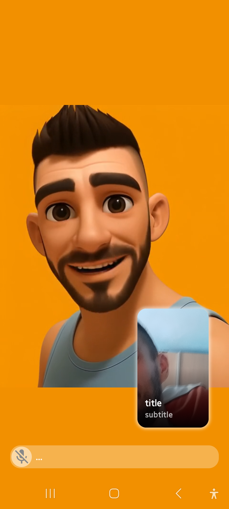
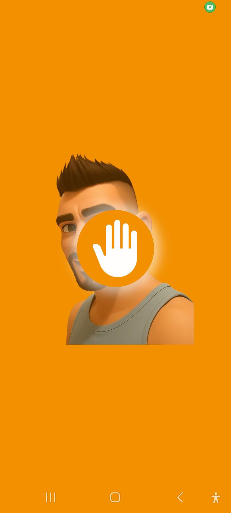
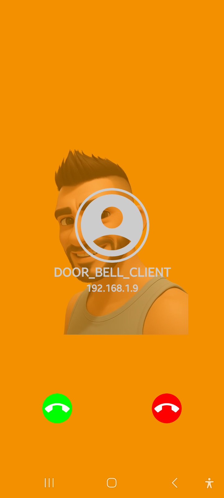
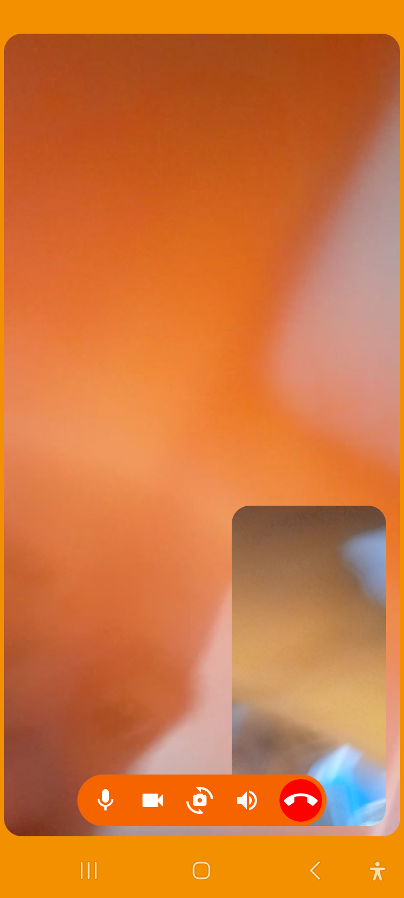
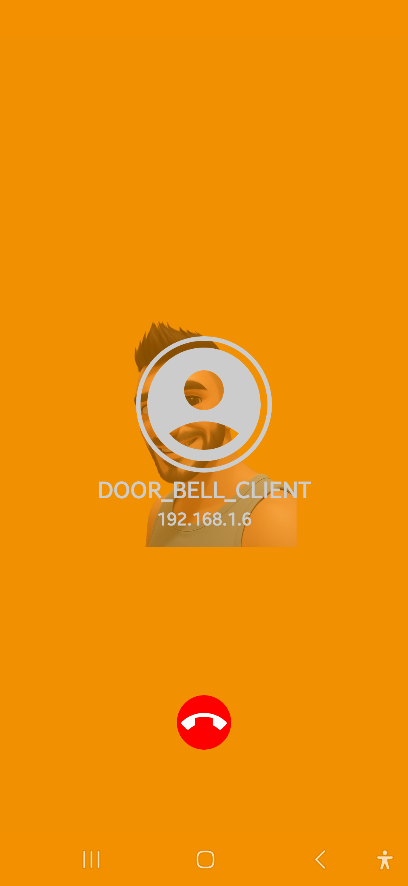
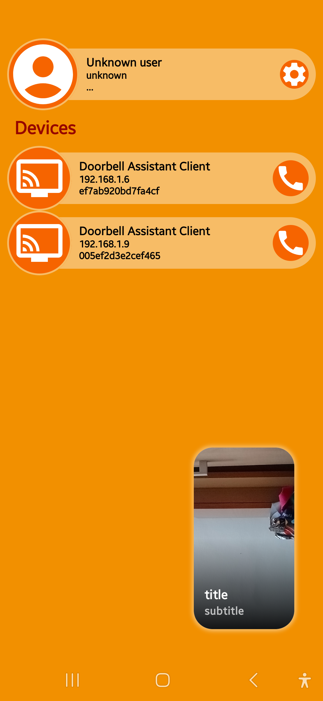
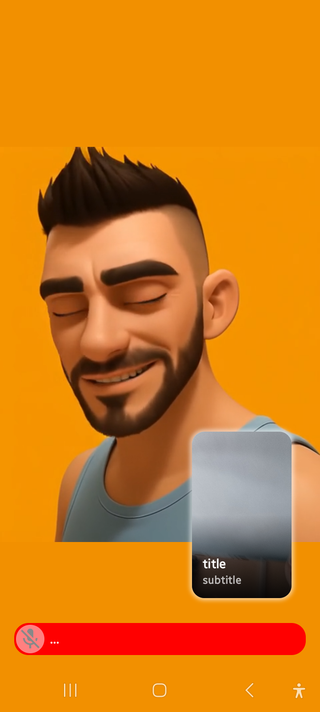

## Motion detection AI doorbell assistant/intercom

The application is designed to be used on old Android devices.
It can be used as an entrance check camera, phone and a doorbell.
After motion is detected, if the app is run as a home launcher or run as an assistant,
it sends an event to the local area network that on client devices with
the same app shows video from the sender in a small right bottom square.
It can be dismissed by click.

The application also includes a VoIP phone that can be used for remote
communication with an assistant device or between all clients.

Simply, it allows local area network calls.

### Achieved so far:

- motion detection
- audio detection
- VoIP phone
- stateful media player
- auto LAN NSD discovery
- some cute design
- phone library that can be customized on the fly
- permission component compose for Android
- voice AI transcription / voice detection part
- koog preimplementation
- auto-discovery AI ollama server

### To do:

- remove video glitch
- improve motion detection, may be with ai?
- improve audio detection - service
- better voice handling with noise reduction and auto-adaptation
- better background layer
- STT / TTS completion
- dependencies injection
- improve performance
- flows everywhere possible
- image of client device if set
- as application is install and play, no config needed, settings button removal
- custom id for clients, can be set from device user name, may be...
- record activities around if needed

### Screens:

<!--suppress ALL -->
<table>
  <tr>
    <td></td>
    <td></td>
  </tr>
  <tr>
    <td></td>
    <td></td>
    <td></td>
    <td></td>
    <td></td>
  </tr>
</table>

### Used libraries & sw
- [Koog Jetbrains](https://www.jetbrains.com/koog/)
- [Kotlin](https://kotlinlang.org/)
- [Jetpack Compose](https://developer.android.com/jetpack/compose)
- [Coroutines](https://developer.android.com/topic/libraries/architecture/coroutines)
- [OkHttp](https://square.github.io/okhttp/)
- [Kotlinx Serialization](https://github.com/Kotlin/kotlinx.serialization)
- [Kotlinx.coroutines](https://github.com/Kotlin/kotlinx.coroutines)
- [Kotlinx.io](https://github.com/Kotlin/kotlinx.io)
- [Kotlinx.text](https://github.com/Kotlin/kotlinx.text)
- [Ktor](https://ktor.io/)
- [Vosk](https://github.comalphacep/vosk)
- [Glance](https://developer.android.com/training/wearables/notifications/glance)
- [ExoPlayer](https://developer.android.com/guide/topics/media/exoplayer)
- [Appcompanist Permissions](https://github.com/google/accompanist)
- [Camera2](https://developer.android.com/training/camera/cameradirect)
- [Kodein](https://github.com/Kodein-Framework/Kodein-DB)
- [Gson](https://github.com/google/gson)
- [Stream WebRtc](https://getstream.io/resources/projects/webrtc/platforms/android-kotlin/)
- [Pallete](https://github.com/google/accompanist)
- [BouncyCastle](https://github.com/bcgit/bc-java)

### License

This project is licensed under the MIT License - see the [LICENSE](LICENSE) file for details

      
